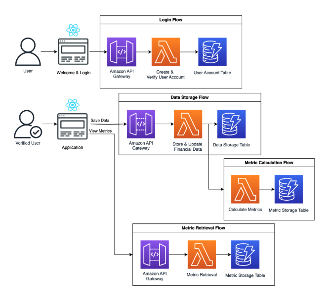

# Application Flow & Architecture

## Architecture Diagram
- **Overview**:  
    - **Frontend**: Built using React for a seamless user experience with responsive design.
    - **Backend**: Powered by various AWS Services including API Gateway and Lambda Functions to handle API requests and business logic.
    - **Database**: Centralized storage using AWS DynamoDB for secure data management.
    - **Hosting**: Deployed on AWS Elastic Beanstalk with CI/CD pipeline to ensure continuous delivery.
  

---

## Flow of Application

### 1. User Login & Authentication
- **Description**:  
  Secure user authentication ensures that only authorized personnel can access the application.
    - Users register or log in using username and password 
    - Passwords are encrypted and stored securely following industry standards 
    - Session management uses secure tokens 

- **Flow**:
    1. User creates account and/or enters login credentials
    2. Backend verifies credentials via authentication service
    3. Upon successful login, a secure session is created

---

### 2. Data Entry
- **Description**:  
  Users input their autobody shop's financial data into structured forms
    - Real-time validation ensures data accuracy 
    - Data is stored securely in the database

- **Flow**:
    1. User accesses the data entry dashboard.
    2. Inputs key financial figures such as revenue, costs, and operational expenses.
    3. Submits the data for processing

---

### 3. Metric Calculation
- **Description**:  
  The system automatically processes input data to generate key performance metrics and benchmarks.
    - Uses predefined formulas and algorithms to calculate profitability, efficiency, and other metrics.
    - Saves the metrics in secure database 

- **Flow**:
    1. System is triggered upon saving data and processes the user-submitted data
    2. Calculates metrics like subtotals and gross profit
    3. Stores the results for user access in the reports section

---

### 4. Report Generation
- **Description**:  
  Users view comprehensive reports based on calculated metrics, enabling data-driven decisions.
  
- **Flow**:
    1. User navigates to the reports dashboard.
    2. Selects specific metrics and time periods for analysis.
    3. Views the generated table for the metric data
