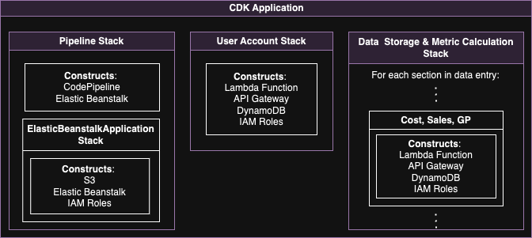

# CDK Infrastructure As Code

The AWS Cloud Development Kit (CDK) allows for the infrastructure to be defined as code, making it easier to manage, share, and scale cloud resources.

### Why Choose CDK with CodePipeline?

- **Infrastructure as Code:** Define, version, and share infrastructure with familiar programming languages.
- **Easy Rollback:** Quickly revert to previous deployments if needed, allowing for stability.
- **Repeatable Deployments:** Automate and replicate consistent deployments across environments with ease.

### CDK in this Application

...

[Automated Development & Deployment](development.md)
