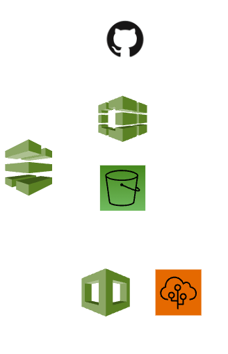
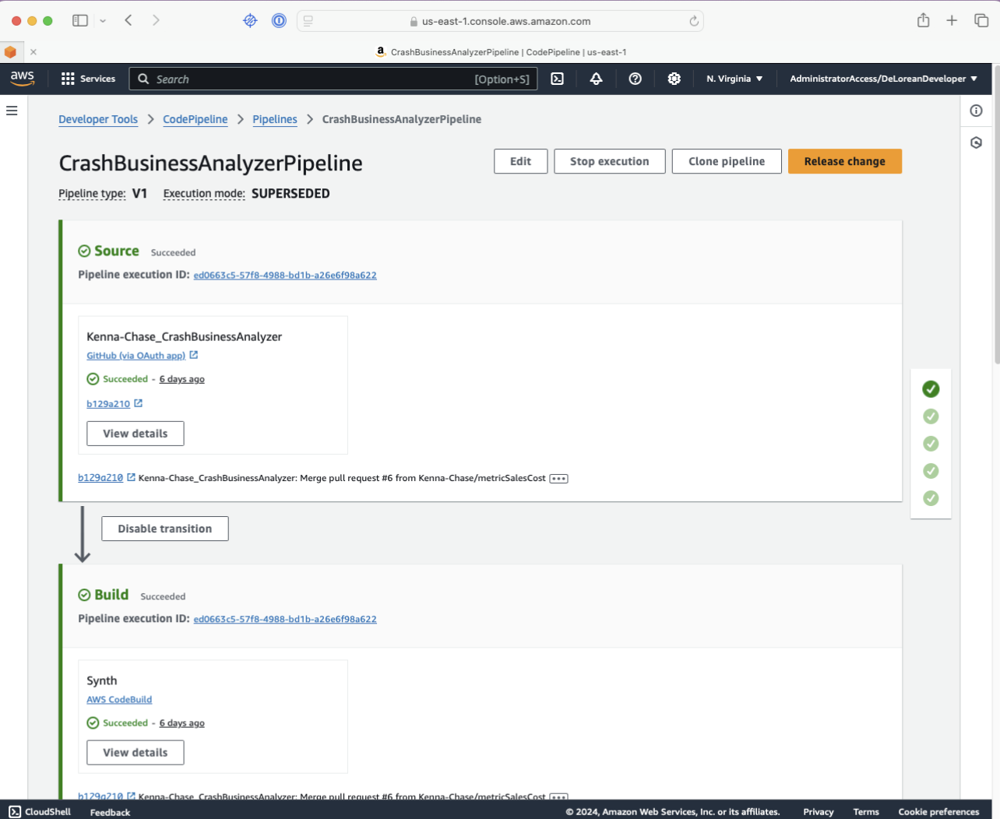
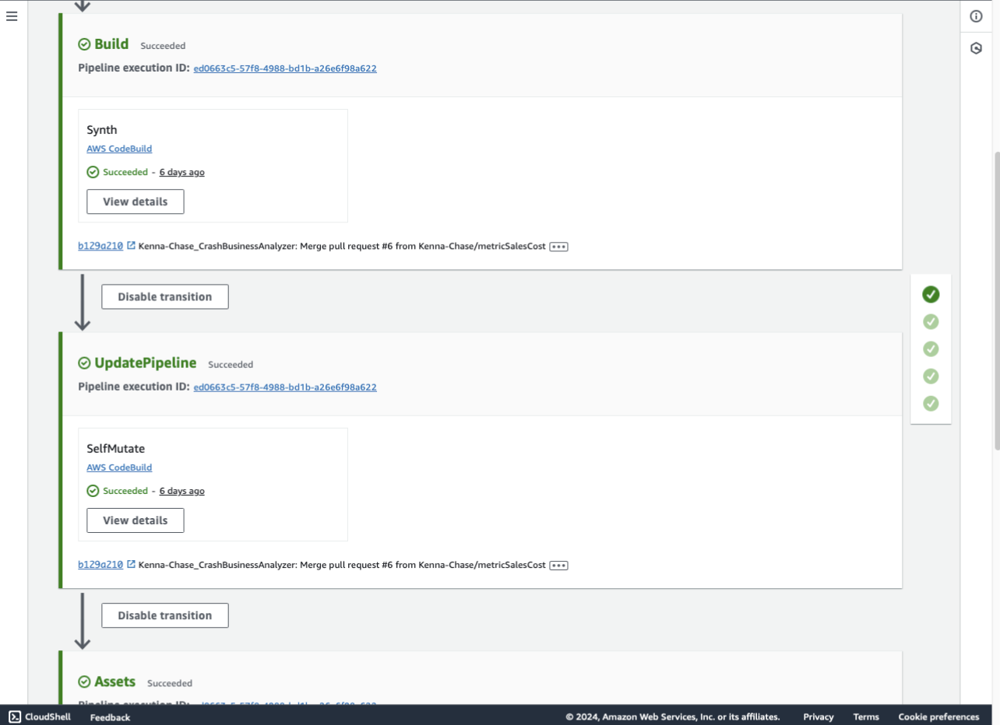
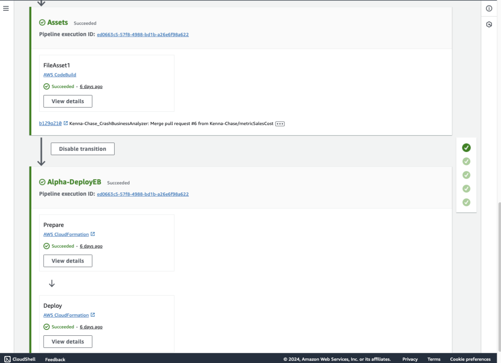

# Automated Development & Deployment

### CodePipelines
For this project, an AWS CDK CodePipeline was used to automate the deployment process of the application. This code pipeline was triggered when there were changes to the main branch of the Github Repository. 
The code pipeline automatically deployed the necessary CDK changes as well as automated the process of deploying the web application to Elastic Beanstalk. 

AWS CodePipelines allow for:
- **Automate Deployments:** Build pipelines that automatically test, validate, and deploy your application to multiple environments.
- **Ensure Consistency:** Utilizes infrastructure as code to enable consistent deployments of the resources.

## Implementation: 
The images below illustrate the CodePipeline used in this progress as well as how it is seen in the AWS Console.

**Diagram:**

**AWS Console:** 

